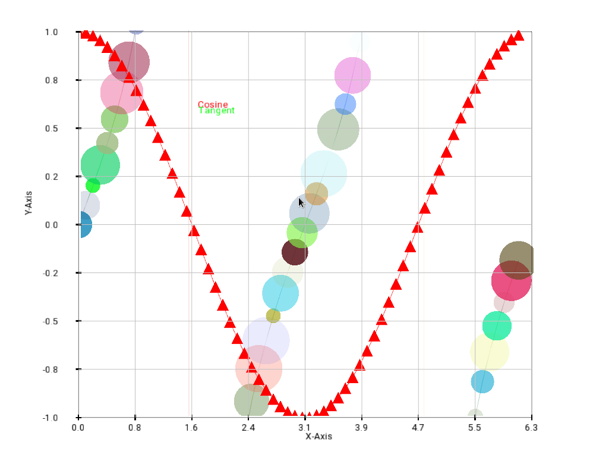
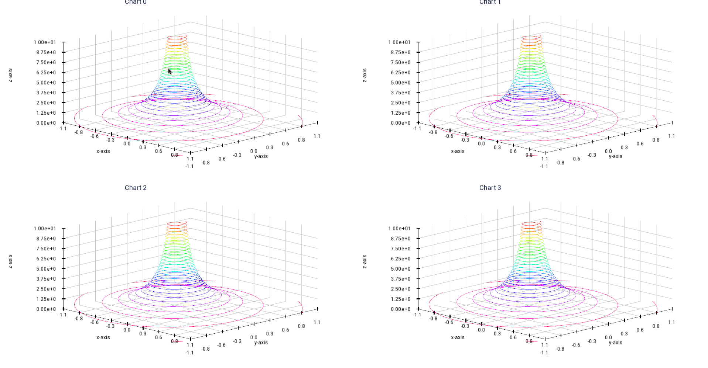

[![docs][8]][9] [![slack][10]][7]

## Forge - High Performance Visualizations
| Platform | Linux x86 | Linux aarch64 | Windows | OSX |
|:--------:|:---------:|:-------------:|:-------:|:---:|
| Status   | [![Build Status][1]][2] | `Unknown` | [![Build Status][12]][13] | [![Build Status][12]][13] |

An OpenGL interop library that can be used with ArrayFire or any other application using CUDA or OpenCL compute backend. The goal of **Forge** is to provide high performance OpenGL visualizations for C/C++ applications that use CUDA/OpenCL. Forge uses OpenGL >=3.3 forward compatible contexts, so please make sure you have capable hardware before trying it out.

Build instructions for forge can be found on our [GitHub wiki page][11].

### Sample Images
|     |     |
|-----|-----|
| Image</img> | 2D Plot</img>  |
| 3d Plot</img> | Rotated 3d Plot</img> |
| histogram</img> | Surface</img> |

|     |     |
|-----|-----|
|    <figcaption>Fig.1 - Pan and Scale</figcaption> |    <figcaption>Fig.2 - Per Cell Rotation in Grid Layour</figcaption>  |

[1]: https://travis-ci.com/arrayfire/forge.svg?branch=master
[2]: https://travis-ci.com/arrayfire/forge
[5]: https://travis-ci.com/arrayfire/forge.svg?branch=master
[6]: https://travis-ci.com/arrayfire/forge
[7]: https://join.slack.com/t/arrayfire-org/shared_invite/enQtMjI4MjIzMDMzMTczLWM4ODIyZjA3YmY3NWEwMjk2N2Q0YTQyNGMwZmU4ZjkxNGU0MjYzYmUzYTg3ZTM0MDQxOTE2OTJjNGVkOGEwN2M
[8]: https://img.shields.io/badge/forge-Docs-blue?logo=readthedocs
[9]: http://arrayfire.org/forge/index.html
[10]: https://img.shields.io/badge/forge-community-e69138?logo=slack
[11]: https://github.com/arrayfire/forge/wiki
[12]: https://github.com/arrayfire/forge/workflows/ci/badge.svg
[13]: https://github.com/arrayfire/forge/actions
